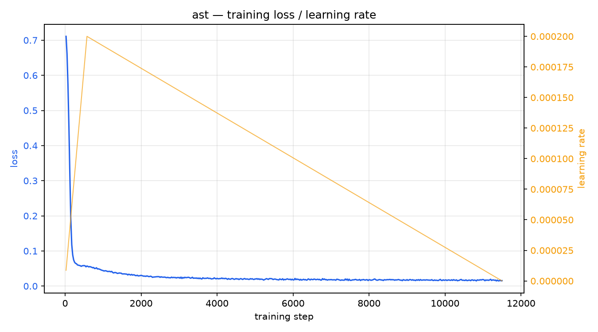
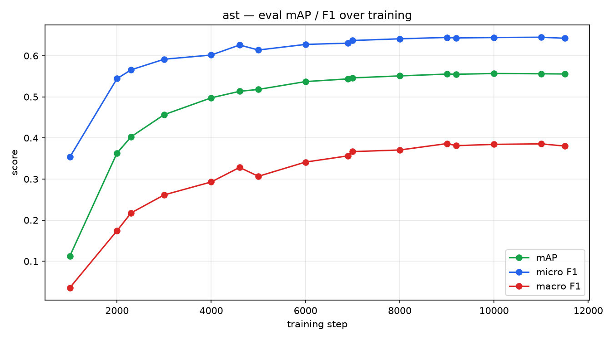
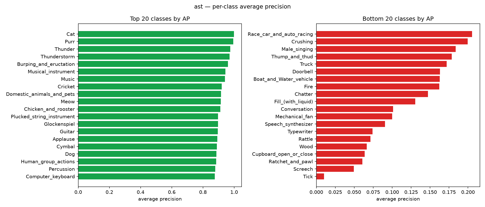

# ast — FSD50K training report

Generated directly from the completed training run's saved artifacts (train_stdout.log, metrics/eval_step_*.json, best_metrics.json). Every number below is a real measurement, not an estimate.

## Run configuration

- Model: `ast`
- Epochs: 5
- Batch size: 4
- Learning rate: 0.0002
- Mixed precision: fp16
- Train rows: n/a
- Val rows: 4170

## Final metrics (best checkpoint)

| Metric | Value |
|---|---:|
| mAP | 0.5567 |
| Micro Average Precision | 0.7166 |
| Macro F1 | 0.3843 |
| Micro F1 | 0.6443 |
| Macro Precision | 0.6113 |
| Macro Recall | 0.3235 |
| Micro Precision | 0.8091 |
| Micro Recall | 0.5353 |

## Training curves

## Per-class average precision (best/worst performing classes)

## Eval progression (raw numbers)

| Step | Epoch | Eval Loss | mAP | Micro F1 | Macro F1 |
|---:|---:|---:|---:|---:|---:|
| 1000 | - | 0.0612 | 0.1128 | 0.3535 | 0.0356 |
| 2000 | - | 0.0398 | 0.3633 | 0.5443 | 0.1742 |
| 2300 | - | 0.0374 | 0.4029 | 0.5657 | 0.2176 |
| 3000 | - | 0.0335 | 0.4566 | 0.5915 | 0.2614 |
| 4000 | - | 0.0315 | 0.4976 | 0.6017 | 0.2929 |
| 4600 | - | 0.0308 | 0.5134 | 0.6261 | 0.3282 |
| 5000 | - | 0.0314 | 0.5180 | 0.6139 | 0.3067 |
| 6000 | - | 0.0306 | 0.5371 | 0.6276 | 0.3412 |
| 6900 | - | 0.0303 | 0.5437 | 0.6306 | 0.3564 |
| 7000 | - | 0.0302 | 0.5461 | 0.6371 | 0.3667 |
| 8000 | - | 0.0300 | 0.5509 | 0.6412 | 0.3707 |
| 9000 | - | 0.0299 | 0.5554 | 0.6445 | 0.3862 |
| 9200 | - | 0.0298 | 0.5550 | 0.6433 | 0.3813 |
| 10000 | - | 0.0299 | 0.5567 | 0.6443 | 0.3843 |
| 11000 | - | 0.0299 | 0.5561 | 0.6450 | 0.3856 |
| 11500 | - | 0.0299 | 0.5556 | 0.6425 | 0.3803 |
