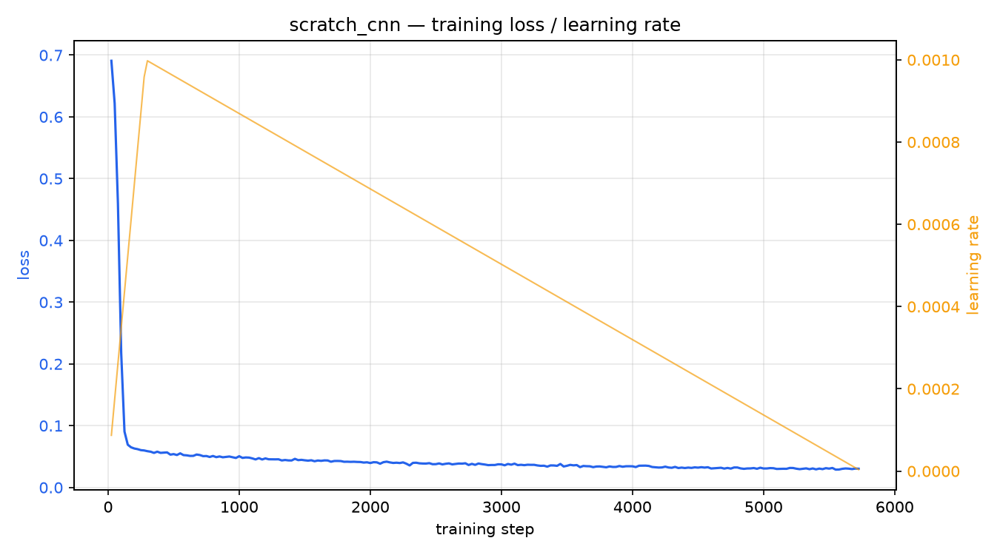
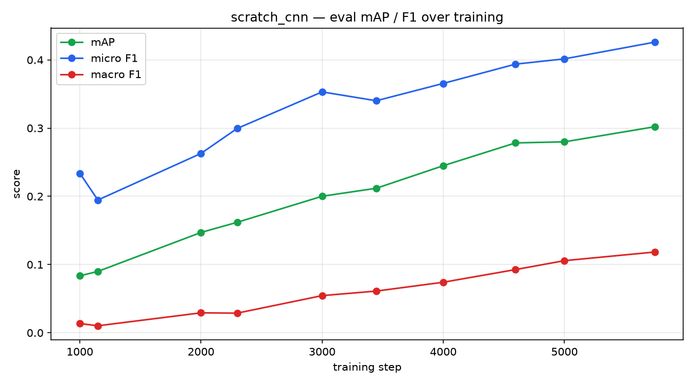
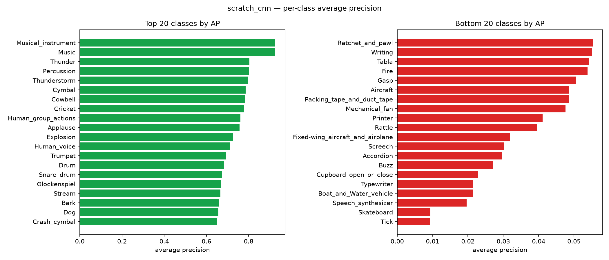

# scratch_cnn — FSD50K training report

Generated directly from the completed training run's saved artifacts (train_stdout.log, metrics/eval_step_*.json, best_metrics.json). Every number below is a real measurement, not an estimate.

## Run configuration

- Model: `scratch_cnn`
- Epochs: 5
- Batch size: 32
- Learning rate: 0.001
- Mixed precision: fp16
- Train rows: n/a
- Val rows: 4170

## Final metrics (best checkpoint)

| Metric | Value |
|---|---:|
| mAP | 0.3020 |
| Micro Average Precision | 0.5343 |
| Macro F1 | 0.1183 |
| Micro F1 | 0.4260 |
| Macro Precision | 0.2651 |
| Macro Recall | 0.0888 |
| Micro Precision | 0.8082 |
| Micro Recall | 0.2892 |

## Training curves

## Per-class average precision (best/worst performing classes)

## Eval progression (raw numbers)

| Step | Epoch | Eval Loss | mAP | Micro F1 | Macro F1 |
|---:|---:|---:|---:|---:|---:|
| 1000 | - | 0.0582 | 0.0834 | 0.2338 | 0.0135 |
| 1149 | - | 0.0572 | 0.0899 | 0.1946 | 0.0103 |
| 2000 | - | 0.0533 | 0.1470 | 0.2629 | 0.0292 |
| 2298 | - | 0.0518 | 0.1619 | 0.2994 | 0.0287 |
| 3000 | - | 0.0490 | 0.2001 | 0.3531 | 0.0544 |
| 3447 | - | 0.0485 | 0.2118 | 0.3401 | 0.0611 |
| 4000 | - | 0.0469 | 0.2449 | 0.3655 | 0.0741 |
| 4596 | - | 0.0439 | 0.2783 | 0.3938 | 0.0926 |
| 5000 | - | 0.0443 | 0.2799 | 0.4015 | 0.1057 |
| 5745 | - | 0.0426 | 0.3020 | 0.4260 | 0.1183 |
